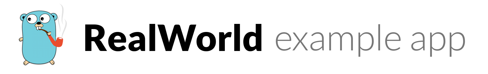

# 

> ### Golang/Gin codebase containing real world examples (CRUD, auth, advanced patterns, etc) that adheres to the [RealWorld](https://github.com/gothinkster/realworld) spec and API.


This codebase was created to demonstrate a fully fledged fullstack application built with **Golang/Gin** including CRUD operations, authentication, routing, pagination, and more.

https://github.com/gothinkster/golang-gin-realworld-example-app

## Environment Config

Environment variables can be set directly in your shell or via a .env file.
Available environment variables:
```
PORT=8080                     # Server port (default: 8080)
GIN_MODE=debug               # Gin mode: debug or release
DB_PATH=./data/gorm.db       # SQLite database path (default: ./data/gorm.db)
JWT_SECRET=replace-me        # Required secret used to sign and verify JWT tokens
```

See .env.example for a complete template.

## Testing
From the project root, run:
```powershell
go test ./...
```

## Test Coverage
Current test coverage (2026):
* Total: -
* articles: -
* users: -
* common: -

Run coverage report:

```powershell
go test -coverprofile='coverage.out' ./...
go tool cover -func='coverage.out'
```